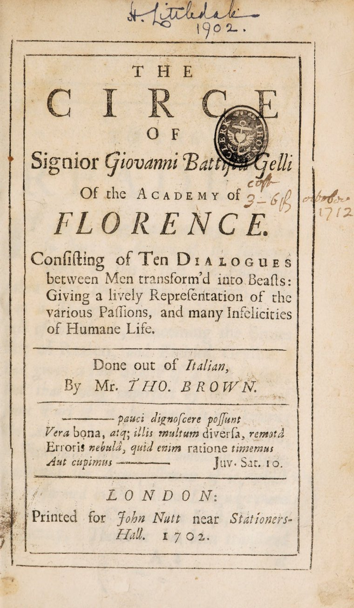

Consisting of Ten DIALOGUES
between Men transform'd into Beasts:
Giving a lively Representation of the
various Passions, and many Infelicities 
of Humane Life. 

Done out of *Italian*,
By Mr. *THO. BROWN.*

## The Table of the Dialogues.

<ol type="I">
<li><a href="ch/1"><em>Ulysses</em> and <em>Circe</em>, with the <em>Oister</em></a>, who had before his Transformation been a <em>Fisher-man</em>; and the <em>Mole</em>, who had been a <em>Plow-man</em>.</li>
<li><a href="ch/2">The same Dialogists, with the <em>Snake</em></a>, who had been a <em>Physician</em>.</li>
<li><a href="ch/3">The same, with the <em>Hare</em></a>, a Country-Gentleman.</li>
<li>——<a href="ch/4">the <em>Goat</em></a>, a Citizen of <em>Corinth</em>.</li>
<li>——<a href="ch/5">the <em>Hind</em></a>, a <em>Grecian</em> Woman.</li>
<li>——<a href="ch/6">the <em>Lion</em></a>, a Sailor.</li>
<li>——<a href="ch/7">the <em>Horse</em></a>,——</li>
<li>——<a href="ch/8">the <em>Dog</em></a>, a Gentleman of Learning.</li>
<li>——<a href="ch/9">the <em>Calf</em></a>.——</li>
<li>——<a href="ch/10">the <em>Elephant</em></a>, a Philosopher.</li>
</ol>

## About this Transcription

This is a transcription of Giovanni Battista Gelli's La Circe, as translated by Thomas Brown.

This translation, published 1702, is in the public domain, but I had difficulty finding a clean transcription of it online, with the automated OCR texts on the [Internet Archive](https://archive.org/details/b30535827/page/n7/mode/2up) plagued by the menace of the 'long s'.

So here is a new transcription, using Claude Opus 4.6. I've instructed the robot to modernize the s's, while otherwise leaving the old timey spelling intact.

Kind Regards,
-Robert Winslow

Last updated 2026 March 16.
